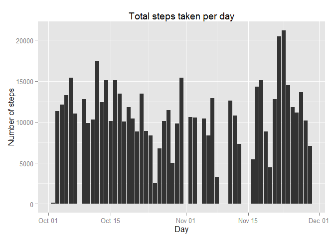
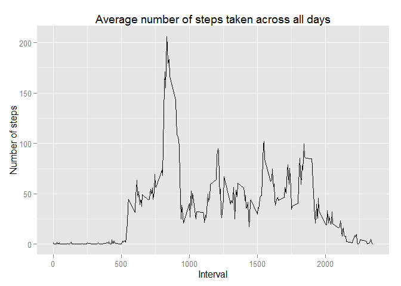
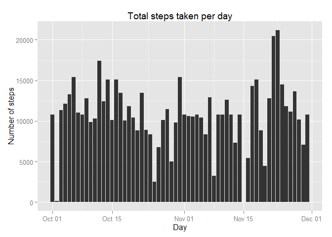
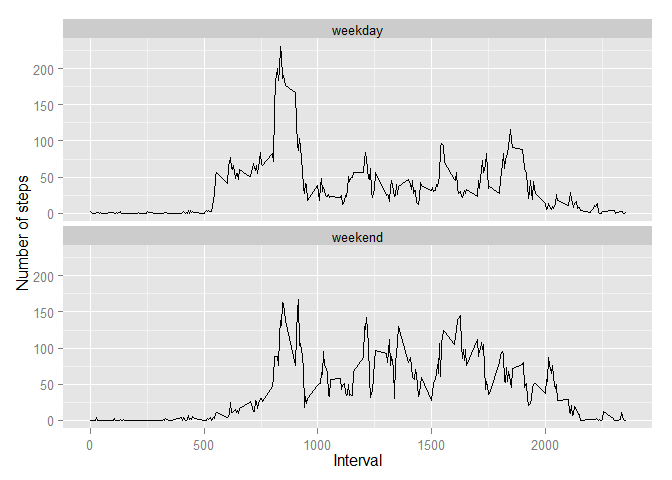

# Reproducible Research: Peer Assessment 1

Load the neccessary libraries

```r
library(ggplot2)
```

```
## Warning: package 'ggplot2' was built under R version 3.1.2
```

## Loading and preprocessing the data
1. Load the data (i.e. read.csv())

```r
unzip("activity.zip")
data <- read.csv("activity.csv")
```

2. Process/transform the data (if necessary) into a format suitable for your 
analysis

```r
data$date <- as.Date(data$date)
data_by_day <- aggregate(steps ~ date, data=data, FUN=sum, na.rm=TRUE)
```

## What is mean total number of steps taken per day?
1. Make a histogram of the total number of steps taken each day

```r
qplot(x=date, y=steps, data=data_by_day,
    stat = "identity", geom = "bar") +
    labs(title="Total steps taken per day", x="Day", y="Number of steps")
```

 

2. Calculate and report the mean and median total number of steps taken per day

* mean total number of steps taken per day

```r
mean(data_by_day$steps)
```

```
## [1] 10766.19
```

* median total number of steps taken per day

```r
median(data_by_day$steps)
```

```
## [1] 10765
```

## What is the average daily activity pattern?
1. Make a time series plot (i.e. type = "l") of the 5-minute interval (x-axis) 
and the average number of steps taken, averaged across all days (y-axis)

```r
data_by_interval <- aggregate(steps ~ interval, data=data, FUN=mean, na.rm=TRUE)
ggplot(data_by_interval, aes(x=interval, y=steps)) +
    geom_line(stat="identity") +
    labs(x="Interval", y="Number of steps") +
    ggtitle("Average number of steps taken across all days")
```

 

2. Which 5-minute interval, on average across all the days in the dataset, 
contains the maximum number of steps?

```r
data_by_interval$interval[which.max(data_by_interval$steps)]
```

```
## [1] 835
```

## Imputing missing values
Note that there are a number of days/intervals where there are missing values 
(coded as NA). The presence of missing days may introduce bias into some 
calculations or summaries of the data.

1. Calculate and report the total number of missing values in the dataset 
(i.e. the total number of rows with NAs)

```r
sum(!complete.cases(data))
```

```
## [1] 2304
```

2. Devise a strategy for filling in all of the missing values in the dataset. 
The strategy does not need to be sophisticated. For example, you could use the 
mean/median for that day, or the mean for that 5-minute interval, etc.


```r
#I will use the means for the 5-minute intervals as fillers for missing values.
```

3. Create a new dataset that is equal to the original dataset but with the 
missing data filled in.

```r
new_data <- data                                                 
for (i in 1:nrow(new_data)) {
    if (is.na(new_data$steps[i])) {
        new_data$steps[i] <- ceiling(data_by_interval[which(new_data$interval[i] 
                                    == data_by_interval$interval), ]$steps)
    }
}

head(new_data)
```

```
##   steps       date interval
## 1     2 2012-10-01        0
## 2     1 2012-10-01        5
## 3     1 2012-10-01       10
## 4     1 2012-10-01       15
## 5     1 2012-10-01       20
## 6     3 2012-10-01       25
```

4. Make a histogram of the total number of steps taken each day and Calculate 
and report the mean and median total number of steps taken per day. Do these 
values differ from the estimates from the first part of the assignment? What is 
the impact of imputing missing data on the estimates of the total daily number 
of steps?

* Histogram of the total number of steps taken each day

```r
new_by_day <- aggregate(steps ~ date, data=new_data, FUN=sum, na.rm=TRUE)

qplot(x=date, y=steps, data=new_by_day, 
    stat = 'summary', fun.y = 'sum', geom='bar') +
    labs(title='Total steps taken per day', x='Day', y='Steps')
```

 

* Mean total number of steps taken per day

```r
mean(new_by_day$steps)
```

```
## [1] 10784.92
```

* Median total number of steps taken per day

```r
median(new_by_day$steps)
```

```
## [1] 10909
```

## Are there differences in activity patterns between weekdays and weekends?
For this part the weekdays() function may be of some help here. Use the dataset 
with the filled-in missing values for this part.

1. Create a new factor variable in the dataset with two levels - "weekday" and 
"weekend" indicating whether a given date is a weekday or weekend day.

```r
day_of_week <- function(date) {
    if (weekdays(as.Date(date)) %in% c("Saturday", "Sunday")) {
        "weekend"
    } else {
        "weekday"
    }
}
new_data$day_of_week <- as.factor(sapply(new_data$date, day_of_week))
```

2. Make a panel plot containing a time series plot (i.e. type = "l") of the 
5-minute interval (x-axis) and the average number of steps taken, averaged 
across all weekday days or weekend days (y-axis). See the README file in the 
GitHub repository to see an example of what this plot should look like using 
simulated data.

```r
new_by_interval <- aggregate(steps ~ interval+day_of_week, data=new_data, 
                             FUN=mean, na.rm=TRUE)

ggplot(new_by_interval, aes(x=interval, y=steps)) + 
    geom_line(color="steelblue", size=1) + 
    facet_wrap(~ day_of_week, nrow=2, ncol=1) +
    labs(x="Interval", y="Number of steps")
```

 

### Information about the analysis environment

```r
print(sessionInfo(), locale=FALSE)
```

```
## R version 3.1.1 (2014-07-10)
## Platform: x86_64-w64-mingw32/x64 (64-bit)
## 
## attached base packages:
## [1] stats     graphics  grDevices utils     datasets  methods   base     
## 
## other attached packages:
## [1] ggplot2_1.0.0
## 
## loaded via a namespace (and not attached):
##  [1] colorspace_1.2-4 digest_0.6.4     evaluate_0.5.5   formatR_1.0     
##  [5] grid_3.1.1       gtable_0.1.2     htmltools_0.2.6  knitr_1.8       
##  [9] labeling_0.3     MASS_7.3-33      munsell_0.4.2    plyr_1.8.1      
## [13] proto_0.3-10     Rcpp_0.11.3      reshape2_1.4     rmarkdown_0.2.64
## [17] scales_0.2.4     stringr_0.6.2    tools_3.1.1      yaml_2.1.13
```
